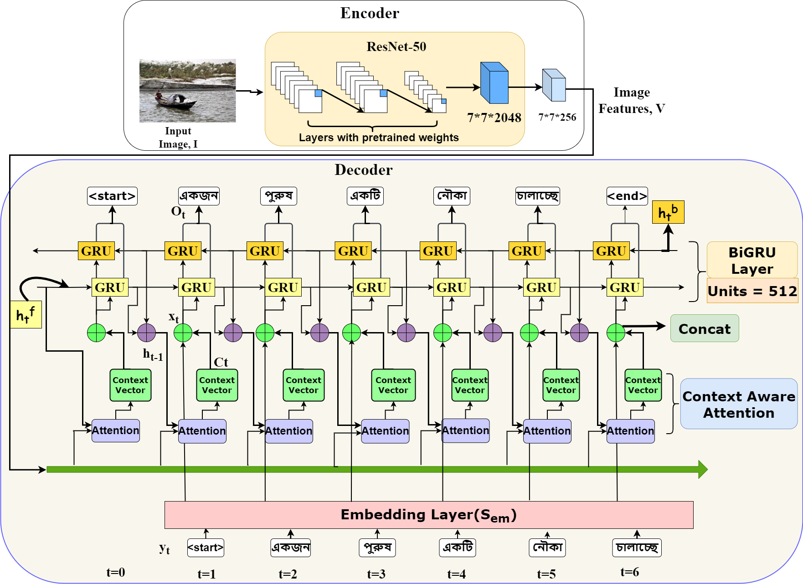

## 🚀 Enhancing image caption generation through context-aware attention mechanism

### Authors

- <u>[Ahatesham Bhuiyan](https://github.com/ahatesham02)</u>, 
<u>[Eftekhar Hossain](https://github.com/eftekhar-hossain)</u>, 
<u>[Mohammed Moshiul Hoque](https://scholar.google.com/citations?user=srYxYhcAAAAJ&hl=en)</u>, 
<u>[M. Ali Akber Dewan](https://scholar.google.ca/citations?user=N6rTw2AAAAAJ&hl=en)</u>


#### Paper : <u>[Paper in Heliyon Journal](https://www.sciencedirect.com/science/article/pii/S2405844024123031)</u>

#### Publication Date: August, 2024

### Abstract
Image captioning, the process of generating natural language descriptions based on image content, has garnered attention in AI research for its implications in scene understanding and human-computer interaction. While much prior research has focused on caption generation for English, addressing low-resource languages like Bengali presents challenges, particularly in producing coherent captions linking visual objects with corresponding words. This paper proposes a context-aware attention mechanism over semantic attention to accurately diagnose objects for image captioning in Bengali. The proposed architecture consists of an encoder and a decoder block. We chose ResNet-50 over the other pre-trained models for encoding the image features due to its ability to solve the vanishing gradient problem and recognize complex object features. For decoding generated captions, a bidirectional Gated Recurrent Unit (GRU) architecture combined with an attention mechanism captures contextual dependencies in both directions, resulting in more accurate captions. The paper also highlights the challenge of transferring knowledge between domains, especially with culturally specific images. Evaluation of three Bengali benchmark datasets, namely BAN-Cap, BanglaLekhaImageCaption, and Bornon, demonstrates significant performance improvement in METEOR score over existing methods by approximately 30%, 18%, and 45%, respectively. The proposed context-aware, attention-based image captioning system significantly outperforms current state-of-the-art models in Bengali caption generation despite limitations in reference captions on certain datasets.

### Contributions
- This work demonstrates the superiority of incorporating ResNet-50 and a context-aware attention network over the conventional encoder-decoder architecture in Bangla image captioning. The proposed approach outperforms existing methods by leveraging contextual information and achieving higher accuracy in generating captions.
- Through extensive experiments on three benchmark datasets, we analyze the adaptiveness of image captioning outcomes across domains, showcasing the potential of cross-domain transfer for generating accurate out-of-domain image captions.

### Methodology

<p align="center">
    <a href="https://github.com/ahatesham02/Image-Captioning-Bangla--Heliyon-Journal/blob/main/Images/methodology.drawio.png"></a> <br>
   An overview of the proposed encoder-decoder architecture for image captioning, where the upper block depicts image features (V) extraction by pre-trained ResNet-50 and the bottom block represents the decoder architecture incorporated with context-aware attention and bidirectional GRU.
</p>

### Citation
If you find our works useful for your research and applications, please cite using this BibTeX:
```bibtex

@article{bhuiyan2024enhancing,
  title={Enhancing Image Caption Generation Through Context-Aware Attention Mechanism},
  author={Bhuiyan, Ahatesham and Hossain, Eftekhar and Hoque, Mohammed Moshiul and Dewan, M Ali Akber},
  journal={Heliyon},
  year={2024},
  publisher={Elsevier}
}

